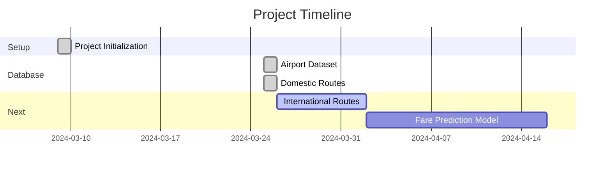

# ✈️ Flight Fair Predictor Project Journal

## 📋 Project Overview

> This journal documents the development progress of the Flight Fair Predictor project, tracking key milestones, decisions, and implementations.

---

## 📅 Timeline

### 🚀 March 9, 2024 - Project Initialization

- 📁 Project repository created
- ⚙️ Initial setup and structure established
- 📝 _Note: Earlier activities were not documented in real-time_

### 🌟 March 25, 2024 - Comprehensive Airport and Route Database Development

#### 🏆 Major Achievements

1. **🌍 Global Airport Dataset Creation**

   ```mermaid
   pie title Airport Distribution
     "Large Airports" : 474
     "Medium Airports" : 2700
   ```

   - Created a comprehensive dataset of airports worldwide
   - Filtered and processed airports based on type (large and medium)
   - Included key information: IATA codes, coordinates, city, country, etc.
   - Total airports processed: 3,174

2. **🛫 Domestic Flight Connections Implementation**

   | Feature                 | Description                                 |
   | ----------------------- | ------------------------------------------- |
   | ↔️ Bidirectional Routes | If A → B exists, B → A also exists          |
   | 🌐 Distance Handling    | No arbitrary distance limitations           |
   | 🎯 Network Model        | Realistic hub-and-spoke based on importance |
   | 🌟 Hub Processing       | Special handling for major global hubs      |

3. **📊 Route Generation Statistics**

   Top 5 Countries by Domestic Routes:

   | Country          | Routes | Visual       |
   | ---------------- | ------ | ------------ |
   | 🇺🇸 United States | 61,138 | ████████████ |
   | 🇨🇳 China         | 14,258 | ███          |
   | 🇷🇺 Russia        | 3,750  | █            |
   | 🇨🇦 Canada        | 2,610  | █            |
   | 🇮🇳 India         | 2,024  | █            |

   **Global Coverage:**

   - Total connections: 106,942
   - Countries covered: 172

#### 🔧 Technical Details

1. **✈️ Airport Classification**

   | Airport Type       | Connections | Notes                                  |
   | ------------------ | ----------- | -------------------------------------- |
   | 🌟 Major Hubs      | 35-45       | Extensive domestic networks            |
   | 🔵 Regular Hubs    | ~25         | Key regional connections               |
   | 🟢 Large Airports  | ~15         | Important city airports                |
   | 🟡 Medium Airports | Variable    | Connected to all hubs & large airports |

2. **⚙️ Route Generation Logic**
   ```
   Airport → Priority Calculation → Connection Generation → Bidirectional Verification
        ↓              ↓                      ↓                         ↓
   Size/Type    Hub Status Check    Distance Calculation     Parallel Processing
   ```

#### 📁 Data Files Created

| File Name                  | Description                        | Size           |
| -------------------------- | ---------------------------------- | -------------- |
| `airports.csv`             | 🌍 Comprehensive airport database  | 3,174 entries  |
| `domestic_connections.csv` | 🛫 Complete domestic route network | 106,942 routes |

#### 🎯 Next Steps

- [ ] 🌐 Implement international flight connections
- [ ] 📊 Add route frequency and capacity data
- [ ] 🤖 Begin development of the fare prediction model
- [ ] 📅 Consider adding seasonal route variations

#### 📝 Notes & Improvements

| Achievement              | Impact                              |
| ------------------------ | ----------------------------------- |
| ✅ Bidirectional Routing | More realistic flight networks      |
| ✅ Regional Coverage     | Better small airport representation |
| ✅ Parallel Processing   | Improved computation efficiency     |
| ✅ Hub-based Modeling    | More accurate route distribution    |

---

<div align="center">

### 📈 Project Progress



</div>

---

_Last Updated: March 25, 2024_
